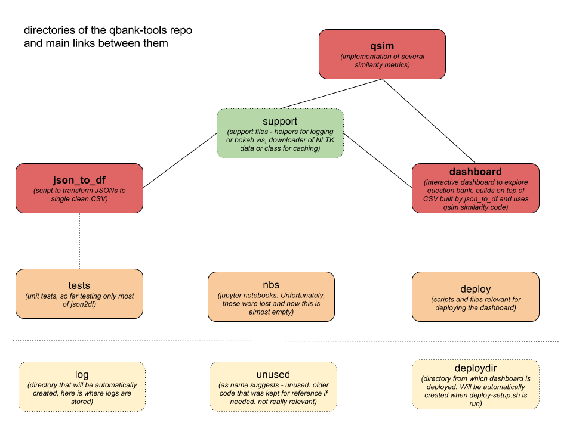

This repo contains some useful code and tools for Question Bank project, mainly:
* **json_to_df**: script to convert JSON files to single clean CSV
* **qsim**: clean implementation several similarity metrics
* **dashboard**: an interactive dashboard to explore the question bank

For further details, see below

# Setting up this repp

You need to have:
* Python3
* anaconda3

Then:
* set PYTHONPATH to contain the root of the project 
* create a new virtual environment `conda create --yes -n <name> python=3.5.2`
* activate the environment
* install dependencies `pip install -r requirements.txt`

Finally:
* in support->common.py, change the DATA constants so that they point to locations, where you have/want to have data stored 

# What's in this repo

As mentioned at the top, there's 3 main pieces of functionality here:
* **json_to_df**
* **qsim**
* **dashboard**

## json_to_df

This is a collection of scripts and functions that convert the JSON files to a single CSV. If you just want to do this,
simply run the `json2df.py` script.

Roughly, the way this works is in a "traverse -> dataframe -> combine" flow:
* **traverse**: JSON files are kind of tree-like structures. Traversing these and outputting relevant nodes 
  (those with tracking code) with all necessary associated information is implemented in `traverse.py`. 
  Notes are also extracted in a separate traversal
* **dataframe**: These nodes are then processed in `dataframing.py`. All kinds of useful information 
  (question text, type, segment texts) is extracted. Some of it is combined 
  (e.g. all "text" fields into a single "all_text" field). Notes are linked. 
  The whole thing is put in a dataframe (one question per row, i.e. one tracking code per row). 
* **combine**: The `json2df.py` file than contains functions to do the above steps for all JSONs, combining 
  everything into a single dataframe, which is saved as CSV. Many of the fields are fairly specific 
  (e.g. 3rd top-most segment's text) and thus 2 versions are saved - one containing everything ("full" version) 
  and one containing just the (subjectively) most useful columns ("light" version) . The rest of the code uses only 
  the light version.
  
There is also a `validation.py` file. Although there was no intention to build JSON validation tool here, 
some validation and correction needed to be done, as the JSONs contained many errors, mainly syntax related. 
Some of these are automatically fixed on the way, while others are collected and only reported. A method in 
`json2df.py` can be used to get the "problems report" for all JSONs.

## qsim

Here similarity metrics are implemented. These are:

* Exact - most basic similarity metric. Outputs 1 if two texts matches, 0 otherwise

* TfIdfCos - a TF-IDF scores are computed first for the corpus. A text is then treated as a vector in the 
vocabulary space with TF-IDF scores being strengths in individual (word) dimensions. 
A [cosine similarity](https://janav.wordpress.com/2013/10/27/tf-idf-and-cosine-similarity/) between
vectors is determining the final similarity

* Jaro - here, similarity is derived using [Jaro-Winkler distance](https://en.wikipedia.org/wiki/Jaro%E2%80%93Winkler_distance) 
(sort of edit distance), scaled to 0-1 range.

* AvgWordVec - a simple method that averages all the [word-vectors](https://en.wikipedia.org/wiki/Word2vec) in the text, and does cosine similarity on the result. 
Different word vectors can be plugged in. Here I've used those from [pre-trained model on GoogleNews](https://github.com/mmihaltz/word2vec-GoogleNews-vectors)
as well as those trained on the data from QuestionBank.

* SentVec - also building on word vectors, this method implements the simple algorithm from [this paper](https://openreview.net/pdf?id=SyK00v5xx).
In general, it is an improved version of AvgWordVec.

All methods are implemented as a single class, inheriting from a common base class.

The word-vec based methods use some pre-processed data, e.g. the word vector themselves. Thus these need to be 
created prior to running these methods. The file `generate_pickles.py` can be used to re-generate necessary data 
that are mostly stored as "pickled" files.

The rest of files in `qsim` contain support code, e.g. for displaying and analyzing similarity results (`sim_analyze.py`).

## dashboard

This contains code for an interactive dashboard to look deeper into the question bank. From user point of view, it 
contains 2 main sub-parts: one for "exploring similarities" and one for "exploring questions"

It is implemented as a web application running on Flask. However, the app uses also HTML, 
CSS and embedded Bokeh server, with Flask serving as a glue in between. A short description of individual elements:

* **Flask server**: in `server.py`, this is the "glue" of the app, defining the routes.
* **Settings**: in `settings.py` - constants used across different app files
* **The "exploring similarities" part**: in `sim_eval.py`, This is basically a standalone Bokeh app that focuses on "exploring similarities". 
In order to support the many interactive widgets, the app must be run on a Bokeh server. The way this is embedded into the Flask
app is via `autoload_server` method from `bokeh.embedd` (see `server.py`). Thus there are 2 servers - a Flask server
running the "main frame" of the application and a Bokeh server running the sim_eval Bokeh app, which is embedded in 
the Flask app.
* **The "exploring questions" part**: the way this works is a bit different. Updates are triggered 
by front end javascript that asynchronously calls Flask routes. There, Bokeh is used, but only to draw charts 
 (`presentation.py`) based on requested data (assembled in `model.py`), which are returned by the flask route 
 to the front-end - which updates inner-html of a given element. This approach requires little more work 
 (for example, one has to create widgets in actual HTML, or use bit more javascript), 
 but it eventually offers more flexibility

### deploying dashboard

You need to have:
* A Heroku account. Free tier should be sufficient, although the app is very near its limits

Then:
* Run the `deploy-setup.sh` script
* Follow by running `deploy-all.sh` script

The deploying actually deploys 2 Heroku apps - one running the Flask server and one running the Bokeh server for
 Sim-eval app (embedded in the first one). Thus 2 browser tabs should popup during the deployment (one for each).
 
 
